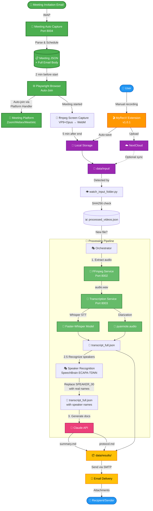

# Rec-Transcribe-Send - Automated Meeting Transcription System


**Rec-Transcribe-Send** is an automated end-to-end system for meeting capture and transcription with support for Russian and English languages. The system can **automatically join meetings** from email invitations, record them with **ffmpeg screen capture** (WebM format, VP9+Opus), extract audio, transcribe speech to text, identify speakers by diarization, **recognize known speakers by voice**, and generate meeting summaries and protocols - all fully automated!

## 🎯 Key Features

### Automated Meeting Capture (v1.2.0)
- **📧 Email Monitoring** - monitors inbox for meeting invitations via IMAP
- **🤖 Auto-Join Meetings** - automatically joins meetings from 7+ platforms (Zoom, Webex, Google Meet, etc.)
- **🎥 ffmpeg Screen Capture** - records full desktop screen + audio (WebM format, VP9+Opus)
- **🎬 High Quality Recording** - SD video (CRF 33, 15fps) + High audio (128kbps Opus)
- **⏰ Smart Scheduling** - joins 2 min before, stops 5 min after meeting
- **💾 Full Email Body Saved** - preserves complete email content in JSON for future use
- **🚫 No Recording Indicator** - Browser doesn't show recording badge on screen

### Core Processing
- **🎵 Audio Extraction** from video files (FFmpeg)
- **📝 Speech Transcription** with Russian language support (Faster-Whisper)
- **🎤 Speaker Diarization** (pyannote.audio)
- **🎭 Speaker Recognition** - 🆕 identify known speakers by voice (SpeechBrain ECAPA-TDNN)
- **📄 Document Generation** - summaries and meeting protocols (Claude API)
- **🔒 Local Processing** - all components except Claude API run locally for data confidentiality

### Recording & Integration
- **🎥 ffmpeg Screen Capture** - external desktop recording with VP9+Opus (no browser recording indicator)
- **🎬 Chrome Extension (MyRecV)** - optional manual recording from browser
- **👁️ Automatic Monitoring** - watches input folder for new files
- **📧 Email Integration** - automatic delivery of results to meeting participants
- **☁️ NextCloud Support** - cloud storage for recordings

### RAG Knowledge Base (v1.4.0)
- **🔍 OpenWebUI RAG Search** - 🆕 semantic search across all meeting transcripts
- **🧠 Hybrid Search** - combines BM25 keyword + semantic vector search
- **📚 Qdrant Vector Database** - fast HNSW-indexed vector storage
- **🎯 BGE-M3 Embeddings** - state-of-the-art multilingual embeddings (1024-dim)
- **⚡ GPU Acceleration** - CUDA support for fast embedding generation
- **🔗 LiteLLM Proxy** - unified API for Claude/OpenRouter models
- **📤 Chrome Extension RAG Upload** - 🆕 manual upload button for meetings
- **🤖 Telegram Bot Interface** - 🆕 search meetings via Telegram with user whitelist

## 📊 System Architecture

### Automated End-to-End Flow


```mermaid
flowchart TB
    %% Automated meeting capture with ffmpeg
    EmailInvite([📧 Meeting Invitation Email]) -->|IMAP| AutoCapture[🤖 Meeting Auto Capture<br/>Port 8004]

    AutoCapture -->|Parse & Schedule| MeetingDB[(📋 Meeting JSON<br/>+ Full Email Body)]
    MeetingDB -->|2 min before start| Browser[🌐 Playwright Browser<br/>Auto-Join]

    Browser -->|Auto-join via<br/>Platform Handler| Meeting[👥 Meeting Platform<br/>Zoom/Webex/Meet/etc]
    Browser -->|Meeting started| FFmpegRec[🎥 ffmpeg Screen Capture<br/>VP9+Opus → WebM]

    FFmpegRec -->|5 min after end| LocalSave[💾 Local Storage]

    %% Manual recording path
    User([👤 User]) -->|Manual recording| Extension[🎬 MyRecV Extension<br/>v1.0.1]

    %% Recording options
    Extension -->|Auto-save| LocalSave
    Extension -->|Upload| NextCloud[☁️ NextCloud]

    %% Local processing path
    LocalSave --> InputFolder[📁 data/input/]
    NextCloud -.->|Optional sync| InputFolder

    %% Automatic monitoring
    InputFolder -->|Detected by| Watcher[👁️ watch_input_folder.py]
    Watcher -->|SHA256 check| Database[(📊 processed_videos.json)]
    Database -->|New file?| Orchestrator[🎭 Orchestrator]

    %% Processing pipeline
    subgraph Processing["🔄 Processing Pipeline"]
        direction TB
        Orchestrator -->|1. Extract audio| FFmpeg[🎵 FFmpeg Service<br/>Port 8002]
        FFmpeg -->|audio.wav| Transcription[📝 Transcription Service<br/>Port 8003]
        Transcription -->|Whisper STT| WhisperModel[🤖 Faster-Whisper Model]
        Transcription -->|Diarization| PyannoteModel[🎤 pyannote.audio]
        WhisperModel --> TranscriptJSON[📄 transcript_full.json]
        PyannoteModel --> TranscriptJSON
        TranscriptJSON -->|2.5 Recognize speakers| SpeakerRec[🎭 Speaker Recognition<br/>SpeechBrain ECAPA-TDNN]
        SpeakerRec -->|Replace SPEAKER_00<br/>with real names| TranscriptUpdated[📄 transcript_full.json<br/>with speaker names]
        TranscriptUpdated -->|3. Generate docs| Claude[🧠 Claude API]
    end

    %% Results
    Claude -->|summary.md| Results[📦 data/results/]
    Claude -->|protocol.md| Results
    TranscriptJSON --> Results

    %% Email delivery
    Results -->|Send via SMTP| Email[📧 Email Delivery]
    Email -->|Attachments| Recipient([👤 Recipient/Sender])

    %% Styling - optimized for both light and dark themes
    classDef newClass fill:#4CAF50,stroke:#2E7D32,stroke-width:3px,color:#fff
    classDef userClass fill:#2196F3,stroke:#1565C0,stroke-width:2px,color:#fff
    classDef extensionClass fill:#FF9800,stroke:#E65100,stroke-width:2px,color:#fff
    classDef storageClass fill:#9C27B0,stroke:#6A1B9A,stroke-width:2px,color:#fff
    classDef processClass fill:#66BB6A,stroke:#2E7D32,stroke-width:2px,color:#fff
    classDef aiClass fill:#EC407A,stroke:#AD1457,stroke-width:2px,color:#fff
    classDef resultClass fill:#FFC107,stroke:#F57F17,stroke-width:2px,color:#000

    class EmailInvite,AutoCapture,MeetingDB,Browser,Meeting newClass
    class User,Recipient userClass
    class Extension extensionClass
    class LocalSave,NextCloud,InputFolder storageClass
    class FFmpeg,Transcription,WhisperModel,PyannoteModel processClass
    class Claude aiClass
    class Results,Email resultClass
```

## 🚀 Quick Start

### Prerequisites

- Windows 10/11, Linux, or macOS
- Docker Desktop
- 8+ GB RAM (16+ GB recommended)
- 20+ GB free disk space

### Installation

1. **Clone the repository**
   ```bash
   git clone https://github.com/szhilko196/Rec-Transcribe-Send.git
   cd Rec-Transcribe-Send
   ```

2. **Configure environment variables**

   Create `.env` file from `.env.example`:
   ```bash
   cp .env.example .env
   ```

   Edit `.env` and add your API keys:
   ```env
   CLAUDE_API_KEY=your_claude_api_key_here
   HF_TOKEN=your_huggingface_token_here
   WHISPER_MODEL=medium
   DEVICE=cpu
   LANGUAGE=ru
   ```

   **Getting tokens:**
   - Claude API Key: https://console.anthropic.com/
   - HuggingFace Token: https://huggingface.co/settings/tokens
   - Accept pyannote license: https://huggingface.co/pyannote/speaker-diarization

   **Optional - Speaker Recognition:**
   ```env
   ENABLE_SPEAKER_RECOGNITION=false
   RECOGNITION_THRESHOLD=0.75
   SPEAKER_RECOGNITION_DEVICE=cpu
   SPEAKER_PROFILES_PATH=./data/speaker_profiles
   ```

   **Optional - Diarization Configuration:**
   ```env
   # Architecture type
   USE_NEW_DIARIZATION_ARCHITECTURE=true    # true=full file (accurate, slow), false=chunks (fast, duplicates)

   # Chunk settings
   CHUNK_DURATION_SEC=1800                  # 1800 = 30 min (default), 900 = 15 min, 600 = 10 min

   # Speaker detection
   DIARIZATION_MIN_SPEAKERS=1               # Minimum speakers for auto-detection
   DIARIZATION_MAX_SPEAKERS=10              # Maximum speakers for auto-detection
   # DIARIZATION_NUM_SPEAKERS=3             # Exact number (if known, uncomment)
   ```

   **Optional - Email delivery:**
   ```env
   SMTP_SERVER=smtp.gmail.com
   SMTP_PORT=587
   SMTP_USE_TLS=true
   SMTP_USERNAME=your-email@gmail.com
   SMTP_PASSWORD=your-app-password
   SMTP_FROM_EMAIL=your-email@gmail.com
   SMTP_FROM_NAME=Meeting Transcriber
   ```

3. **Start services**
   ```bash
   docker-compose up -d
   ```

4. **Start automatic processor**

   **Windows:**
   ```bash
   start_auto_processor.bat
   ```

   **Linux/Mac:**
   ```bash
   python services/transcription_orchestrator/watch_input_folder.py
   ```

5. **Add video file**
   ```bash
   # Simply copy video to input folder
   cp your_meeting.mp4 data/input/
   ```

   The system will automatically process the file and create results in `data/results/`

## 🆕 Meeting Auto Capture - Automated Meeting Attendance

**NEW!** The Meeting Auto Capture module enables fully automated meeting attendance and recording.

### How It Works

1. **📧 Email Monitoring** - Service monitors your email inbox (IMAP) for meeting invitations
2. **📋 Parse Invitations** - Extracts meeting details (link, time, participants) + saves full email body to JSON
3. **⏰ Auto-Schedule** - Schedules browser launch 2 minutes before meeting start
4. **🌐 Auto-Join** - Playwright opens browser and joins meeting via platform-specific handler
5. **🎥 ffmpeg Recording** - Starts screen + audio capture (WebM format, VP9+Opus)
6. **⏹️ Auto-Stop** - Stops recording 5 minutes after meeting ends (graceful ffmpeg shutdown)
7. **💾 Auto-Process** - Video saved to `data/input/` → automatically processed by existing pipeline

### Supported Meeting Platforms

- ✅ **gpb.video** (Priority 1)
- ✅ **meeting.psbank.ru** (Priority 2)
- ✅ **Zoom** (zoom.us)
- ✅ **Cisco Webex** (webex.com)
- ✅ **Google Meet** (meet.google.com)
- ✅ **Yandex Telemost** (telemost.yandex.ru)
- ✅ **Custom platforms** (extensible architecture)

### Setup & Installation

**Quick Start:**

```bash
# Windows - Option 1: Use root-level launcher (recommended)
start_meeting-autocapture.bat

# Windows - Option 2: Direct setup and start
cd services/meeting-autocapture
setup.bat
notepad config\.env
start.bat

# Linux/Mac:
cd services/meeting-autocapture
python -m venv venv
source venv/bin/activate
pip install -r requirements.txt
playwright install chromium
cp config/.env.example config/.env
# Edit config/.env
python src/main.py
```

**Required Configuration (config/.env):**

```env
# Email Settings (REQUIRED)
MAC_IMAP_HOST=imap.gmail.com
MAC_IMAP_PORT=993
MAC_IMAP_USER=your-email@gmail.com
MAC_IMAP_PASSWORD=your-app-password        # Gmail App Password
MAC_IMAP_FOLDER=Meetings                   # Email folder to monitor

# Video Output (REQUIRED)
MAC_VIDEO_OUTPUT_FOLDER=../../data/input

# Timing (Optional)
MAC_PRE_MEETING_JOIN_MINUTES=2             # Join 2 min before
MAC_POST_MEETING_BUFFER_MINUTES=5          # Record 5 min after
```

**ffmpeg Installation (REQUIRED):**

**Windows:**
```bash
# Download ffmpeg essentials build
curl -L "https://www.gyan.dev/ffmpeg/builds/ffmpeg-release-essentials.zip" -o ffmpeg.zip

# Extract to tools folder
mkdir C:\prj\Rec-Transcribe-Send\tools
tar -xf ffmpeg.zip -C C:\prj\Rec-Transcribe-Send\tools

# Verify installation
C:\prj\Rec-Transcribe-Send\tools\ffmpeg-8.0-essentials_build\bin\ffmpeg.exe -version
```

**Linux:**
```bash
sudo apt update
sudo apt install ffmpeg
```

**macOS:**
```bash
brew install ffmpeg
```

**Note**: Update `self.ffmpeg_path` in `services/meeting-autocapture/src/browser_joiner.py` if using different path

**Gmail App Password Setup:**
1. Google Account → Security → 2-Step Verification
2. App Passwords → Generate
3. Copy to `MAC_IMAP_PASSWORD`

### Features

- ✅ **Email Body Preservation** - Saves complete HTML + text email body to JSON for future use
- ✅ **Persistent Browser Profiles** - Login to each platform once, then auto-join
- ✅ **Smart Scheduling** - APScheduler-based time management
- ✅ **ffmpeg Screen Capture** - External desktop recording with VP9+Opus (WebM format)
- ✅ **High Quality Audio** - Opus codec at 128kbps for superior audio quality
- ✅ **SD Video Quality** - CRF 33 quality at 15fps for reasonable file sizes
- ✅ **No Recording Indicator** - Browser doesn't show recording badge on screen
- ✅ **Platform Handlers** - Modular architecture for different meeting platforms
- ✅ **Graceful Shutdown** - ffmpeg stops cleanly via stdin 'q' command
- ✅ **State Tracking** - JSON database tracks pending/in-progress/completed meetings

### Documentation

- **Quick Start**: `services/meeting-autocapture/QUICK_START.md`
- **Full Documentation**: `services/meeting-autocapture/README.md`
- **Implementation Plan**: `MeetingAutoCapture_plan.md`
- **ffmpeg Recording**: See README.md "Recent Updates" section

### Testing

```bash
cd services/meeting-autocapture

# Run installation tests
test.bat              # Windows
python test_installation.py  # Linux/Mac

# Should show: 8/8 tests passed
```

### Example Workflow

```
1. Meeting invitation arrives → your-email@gmail.com/Meetings
2. Service detects email (every 60 seconds)
3. Parser extracts: Zoom meeting at 3:00 PM
4. Meeting saved to: data/meetings/pending/{id}.json (with full email body)
5. At 2:58 PM: Browser launches with Zoom profile
6. At 2:59 PM: Auto-joins meeting as "John Doe"
7. At 2:59 PM: ffmpeg starts screen + audio recording (WebM, VP9+Opus)
8. At 4:05 PM: Recording stops (1hr meeting + 5min buffer, graceful shutdown)
9. Video saved: data/input/zoom_20251116_145900_mmmail(sender@email.com)_{id}.webm
10. Orchestrator processes → protocol emailed to sender
```

## 🎥 Chrome Extension - MyRecV (v1.0.1)

**Note**: Chrome extension is now **optional** for manual ad-hoc recordings. The Meeting Auto Capture service uses **ffmpeg screen capture** for automated recordings.

### Installation

1. Open `chrome://extensions/`
2. Enable "Developer mode"
3. Click "Load unpacked"
4. Select `chrome-extension/` folder

### Usage (Manual Recording)

1. Click MyRecV icon in Chrome toolbar
2. Enter task number (e.g., TASK-123)
3. Add description (optional)
4. Click "⏺ RECORD" button
5. Select screen/window/tab to record
6. Click "⏹ STOP" when finished
7. File automatically saves to `data/input/` for processing

### Features

- ✅ Screen + audio recording (WebM format)
- ✅ Audio-only mode
- ✅ Automatic file naming: `TASK-123_Description_2025-01-29_14-30-45.webm`
- ✅ Real-time recording timer
- ✅ Recording history
- ✅ NextCloud integration
- ✅ Hotkeys: `Ctrl+Shift+R` (start), `Ctrl+Shift+S` (stop)
- ✅ **RAG Upload Button** - 🆕 manually upload meetings to OpenWebUI Knowledge Base

### Use Cases

- **Manual ad-hoc recordings** - Record meetings not in email invitations
- **Task-based recordings** - Record specific tasks with task numbers
- **Quick captures** - Fast recording without email setup
- **NextCloud sync** - Automatic cloud upload

**For automated meeting recordings**, use the Meeting Auto Capture service with ffmpeg (no extension required).

## 🎭 Speaker Recognition - Identify Known Speakers by Voice

**NEW!** The Speaker Recognition module identifies known speakers by their voice characteristics, automatically replacing generic labels (`SPEAKER_00`, `SPEAKER_01`) with real names in transcripts.

### How It Works

1. **📚 Voice Enrollment** - Create speaker profiles with 3+ audio samples per person
2. **🧬 Embedding Generation** - SpeechBrain ECAPA-TDNN generates 192-dimensional voice embeddings
3. **🔍 Speaker Matching** - During transcription, system matches voices against enrolled profiles
4. **✨ Name Replacement** - Generic labels replaced with real names in final transcript
5. **🎯 Confidence Scoring** - Only matches above threshold are used (default: 0.75)

### Benefits

- ✅ **Personalized Protocols** - Meeting protocols show real participant names
- ✅ **Better Context** - Easier to follow who said what
- ✅ **Fully Local** - All recognition happens on your machine (no cloud API)
- ✅ **High Accuracy** - ECAPA-TDNN model achieves >95% accuracy with good samples
- ✅ **Fast Processing** - Cached embeddings make recognition instant

### Quick Start

**1. Install SpeechBrain dependencies:**
```bash
cd services/transcription_orchestrator
pip install -r requirements.txt
```

**2. Initialize speaker profiles:**
```bash
python manage_speakers.py --init
```

**3. Enroll a speaker:**
```bash
# Extract 3+ audio samples (5-10 seconds each) from a meeting
python ../../tools/extract_speaker_samples.py --interactive

# Add speaker to database
python manage_speakers.py --add ivan_petrov \
    --name "Иван Петров" \
    --samples "data/speaker_profiles/ivan_petrov/sample_01.wav,data/speaker_profiles/ivan_petrov/sample_02.wav,data/speaker_profiles/ivan_petrov/sample_03.wav" \
    --role "Senior Developer"
```

**4. Enable in .env:**
```env
ENABLE_SPEAKER_RECOGNITION=true
RECOGNITION_THRESHOLD=0.75          # 0.65=lenient, 0.75=balanced, 0.85=strict
SPEAKER_RECOGNITION_DEVICE=cpu      # or 'cuda' for GPU
SPEAKER_PROFILES_PATH=./data/speaker_profiles
```

**5. Process a meeting:**
```bash
# Simply process as usual - recognition happens automatically
cp meeting.mp4 data/input/
```

### Audio Sample Requirements

For best results, provide **3-5 audio samples** per speaker with:
- ✅ **Duration**: 5-10 seconds each (minimum 3 seconds)
- ✅ **Quality**: Clear speech, minimal background noise
- ✅ **Content**: Normal speaking (not shouting/whispering)
- ✅ **Format**: WAV, 16kHz, mono (auto-converted if needed)
- ✅ **Variety**: Different phrases/sentences (not repeating same words)

**Tip**: Extract samples from previous meetings using `extract_speaker_samples.py`

### CLI Tools

**Manage speakers:**
```bash
cd services/transcription_orchestrator

# List all enrolled speakers
python manage_speakers.py --list

# Validate speaker profiles
python manage_speakers.py --validate

# Remove a speaker
python manage_speakers.py --remove ivan_petrov
```

**Extract audio samples:**
```bash
cd tools

# Interactive mode with visual feedback
python extract_speaker_samples.py --interactive

# Extract specific segment
python extract_speaker_samples.py \
    --input data/audio/meeting_123.wav \
    --output data/speaker_profiles/maria/sample_01.wav \
    --start 00:05:30 \
    --duration 7
```

### Before/After Example

**Before (without speaker recognition):**
```json
{
  "speaker": "SPEAKER_00",
  "start": 0.5,
  "end": 3.2,
  "text": "Добрый день, коллеги"
}
```

**After (with speaker recognition):**
```json
{
  "speaker": "Иван Петров",
  "speaker_id": "SPEAKER_00",
  "recognized": true,
  "start": 0.5,
  "end": 3.2,
  "text": "Добрый день, коллеги"
}
```

### Configuration Options

| Variable | Default | Description |
|----------|---------|-------------|
| `ENABLE_SPEAKER_RECOGNITION` | `false` | Enable/disable speaker recognition |
| `RECOGNITION_THRESHOLD` | `0.75` | Confidence threshold (0.0-1.0)<br/>0.65=lenient, 0.75=balanced, 0.85=strict |
| `SPEAKER_RECOGNITION_DEVICE` | `cpu` | Device for recognition: `cpu` or `cuda` |
| `SPEAKER_PROFILES_PATH` | `./data/speaker_profiles` | Path to speaker profiles directory |

### Troubleshooting

**Low accuracy / wrong identifications:**
- Collect more samples (5+ per speaker recommended)
- Use longer samples (8-10 seconds)
- Ensure samples are high quality (clear speech, low noise)
- Increase threshold to 0.85 (more strict)

**Speaker not recognized:**
- Check sample quality and duration
- Lower threshold to 0.65 (more lenient)
- Verify speaker profile with: `python manage_speakers.py --validate`
- Re-enroll with better samples

**"No speaker profiles loaded":**
```bash
# Initialize database
python services/transcription_orchestrator/manage_speakers.py --init

# Verify speakers.json exists
ls data/speaker_profiles/speakers.json
```

**Performance issues:**
- Use GPU: `SPEAKER_RECOGNITION_DEVICE=cuda` (3-4x faster)
- Embeddings are cached - first run is slower
- Recognition adds ~2-5 min for 1-hour meeting

### Documentation

- **Implementation Guide**: `SPEAKER_RECOGNITION_IMPLEMENTATION.md` (comprehensive 30+ page guide)
- **Setup Instructions**: `data/speaker_profiles/README.md`
- **Configuration**: See `.env.example` for all variables

## 🔍 OpenWebUI RAG - Semantic Search Across Meetings

**NEW!** Search all your meeting transcripts, summaries, and protocols using natural language queries through OpenWebUI interface.

### How It Works

1. **📤 Automatic Indexing** - Processed meetings are automatically uploaded to OpenWebUI Knowledge Base
2. **🧬 BGE-M3 Embeddings** - Documents are embedded using state-of-the-art multilingual model (1024-dim)
3. **💾 Qdrant Vector DB** - Vectors stored in fast HNSW-indexed database
4. **🔍 Hybrid Search** - Combines BM25 keyword search + semantic vector search
5. **🎯 Reranking** - BGE-reranker-v2-m3 reranks top results for better accuracy
6. **💬 Chat Interface** - Ask questions in natural language, get answers with citations

### Quick Start

**1. Start OpenWebUI services:**
```bash
cd services/OpenWebUi
docker-compose up -d
```

**2. Configure API keys** (in `services/OpenWebUi/.env`):
```env
ANTHROPIC_API_KEY=sk-ant-...      # For Claude models
OPENAI_API_KEY=sk-or-v1-...       # For OpenRouter (optional)
```

**3. Enable RAG indexing** (in root `.env`):
```env
ENABLE_OPENWEBUI_RAG=true
OPENWEBUI_URL=http://localhost:3000
OPENWEBUI_API_KEY=sk-...          # Generate in OpenWebUI Settings > Account > API Keys
```

**4. Access OpenWebUI:**
- Open http://localhost:3000
- Create account on first visit
- Select a model (e.g., `claude-haiku-3.5`)
- Use `#Meetings` to search the knowledge base

### Searching Meetings

**In OpenWebUI chat:**
```
#Meetings Что обсуждали по проекту КПП?
```

**Example queries:**
- "Кто отвечает за расчеты до 15 марта?"
- "Какие решения приняли по налоговому агентированию?"
- "В какой встрече обсуждали депозитарные счета?"

### Architecture

```
Meeting Processed → Orchestrator → OpenWebUI Uploader
                                         ↓
                              BGE-M3 Embeddings (GPU)
                                         ↓
                              Qdrant Vector Database
                                         ↓
User Query → OpenWebUI → Hybrid Search → Reranker → LLM Response
```

### Services (docker-compose)

| Service | Port | Description |
|---------|------|-------------|
| OpenWebUI | 3000 | Web interface + RAG API |
| Qdrant | 6333 | Vector database |
| LiteLLM | 4000 | LLM proxy (Claude/OpenRouter) |

### Configuration Options

| Variable | Default | Description |
|----------|---------|-------------|
| `ENABLE_OPENWEBUI_RAG` | `false` | Enable automatic RAG indexing |
| `OPENWEBUI_URL` | `http://localhost:3000` | OpenWebUI service URL |
| `OPENWEBUI_API_KEY` | - | API key (generate in UI) |
| `RAG_RELEVANCE_THRESHOLD` | `0.1` | Minimum relevance score (0.0-1.0) |
| `MAX_UNRECOGNIZED_SPEAKERS_FOR_RAG` | `7` | Skip RAG if too many unknown speakers |

### GPU Acceleration

For faster embeddings (47s → 2-3s):

```yaml
# In docker-compose.yml, OpenWebUI uses CUDA image:
image: ghcr.io/open-webui/open-webui:cuda
environment:
  - DEVICE=cuda
deploy:
  resources:
    reservations:
      devices:
        - driver: nvidia
          count: 1
          capabilities: [gpu]
```

### Chrome Extension RAG Upload

The Chrome Extension includes a **"Upload to RAG"** button for manual uploads:

1. Open MyRecV extension
2. Go to "RAG Upload" tab
3. Select a processed meeting folder
4. Click "Upload to RAG"
5. Meeting is indexed in OpenWebUI Knowledge Base

This is useful when:
- Automatic RAG indexing was skipped (too many unrecognized speakers)
- You want to re-index a meeting after renaming speakers
- Testing RAG functionality

### Troubleshooting

**"No sources found" in OpenWebUI:**
- Check `RAG_RELEVANCE_THRESHOLD` (lower to 0.1)
- Verify documents are indexed: check Qdrant collections
- Use `#Meetings` prefix in your query

**Slow embedding (47+ seconds):**
- Enable GPU: use `cuda` image variant
- Check: `docker exec openwebui python -c "import torch; print(torch.cuda.is_available())"`

**LiteLLM model errors:**
- Check API keys in `services/OpenWebUi/.env`
- Verify LiteLLM is running: `docker logs openwebui-litellm`
- Restart: `docker-compose restart litellm`

**Documents not indexing:**
- Check `ENABLE_OPENWEBUI_RAG=true` in root `.env`
- Verify OpenWebUI API key is set
- Check orchestrator logs for upload errors

### Telegram Bot Integration

The **Telegram RAG Bot** provides a convenient mobile interface for searching meetings via Telegram messenger.

**Features:**
- 💬 Search meetings using natural language queries via Telegram
- 👥 User whitelist with admin management
- 📚 Multiple knowledge bases support
- 🌐 Russian and English interface
- 🔐 Secure access control with user authorization

**Quick Start:**
```bash
cd services/telegram-rag-bot
python -m venv venv
venv\Scripts\activate  # Windows
pip install -r requirements.txt
cp config/.env.example .env
# Edit .env with TELEGRAM_BOT_TOKEN and OPENWEBUI_API_KEY
python -m src.main
```

**Commands:**
- `/start` - Welcome message
- `/help` - Show available commands
- `/search <query>` - Search the knowledge base
- `/kb` - List available knowledge bases
- `<text message>` - Direct search query (no command needed)

**Admin Commands:**
- `/adduser <id> <name>` - Add user to whitelist
- `/removeuser <id>` - Remove user from whitelist
- `/listusers` - List all authorized users

**Example Usage:**
```
You: Что обсуждали по проекту КПП?
Bot: [Ответ с цитатами из встреч и ссылками на источники]
```

**Documentation:** `services/telegram-rag-bot/README.md`

### Documentation

- **Integration Guide**: `services/OpenWebUi/INTEGRATION.md`
- **Deployment Status**: `services/OpenWebUi/DEPLOYMENT_STATUS.md`
- **Docker Config**: `services/OpenWebUi/docker-compose.yml`
- **Telegram Bot**: `services/telegram-rag-bot/README.md`

## 📁 Output Structure

Results are saved in `data/results/<video_name>_<timestamp>/`:

```
meeting_2025-01-29_<timestamp>/
├── original_meeting.mp4        # Original video
├── audio.wav                   # Extracted audio (16kHz, mono)
├── transcript_full.json        # Full transcription with timestamps and speaker names
├── transcript_readable.txt     # Human-readable format
├── summary.md                  # Meeting summary (Claude AI)
├── protocol.md                 # Meeting protocol with action items
└── metadata.json               # Processing metadata
```

**Note**: When Speaker Recognition is enabled, `transcript_full.json` will contain real speaker names instead of generic labels (SPEAKER_00 → "Иван Петров").

## 🔧 Technology Stack

### Meeting Auto Capture
- **Python 3.10** - Core language
- **Playwright for Python** - Browser automation
- **ffmpeg 8.0** - Screen + audio capture (VP9+Opus → WebM)
- **IMAPClient** - Email monitoring (IMAP protocol)
- **icalendar** - Calendar file parsing (.ics)
- **APScheduler** - Meeting scheduling
- **Pydantic** - Data validation and models
- **subprocess** - ffmpeg process management

### Backend Services
- **Docker + Docker Compose** - Service containerization
- **FastAPI** - REST API framework
- **FFmpeg** - Audio/video processing
- **Faster-Whisper** - Optimized speech-to-text (4x faster than vanilla Whisper)
- **pyannote.audio** - Speaker diarization with temporal segmentation
- **SpeechBrain** - Speaker recognition with ECAPA-TDNN embeddings (192-dimensional)
- **Claude API** - Document generation
- **Python Watchdog** - Automatic folder monitoring

### Chrome Extension (v1.0.1)
- **Manifest V3** - Modern Chrome extension standard
- **Screen Capture API** - Screen recording
- **MediaRecorder API** - Media recording (VP9 + Opus)
- **File System Access API** - Direct file saving
- **NextCloud WebDAV** - Cloud storage integration
- **CDP Support** - External automation control

## ⚡ Performance

### CPU Mode (Intel i7) with Whisper medium model

**Short videos (<30 minutes) - NEW Architecture:**
- 25 min video → ~15-20 min processing
- Whisper: ~10-15 min
- Diarization (full file): ~3-5 min
- Claude: ~2-5 min

**Long videos (>30 minutes) - NEW Architecture (default):**
- 1 hour video → 30-60 min processing
- Whisper (chunked): ~25-40 min
- Diarization (full file): ~5-15 min ⚠️ **SLOW**
- Claude: ~2-5 min

**Long videos (>30 minutes) - OLD Architecture (faster):**
- 1 hour video → 15-30 min processing
- Whisper (chunked): ~10-20 min
- Diarization (chunked, 15 min chunks): ~5-8 min ✅ **FASTER**
- Claude: ~2-5 min
- ⚠️ May create speaker duplicates

### GPU Mode (NVIDIA RTX 3060)
- 1 hour video → 8-15 min processing
- Whisper: ~3-7 min
- Diarization: ~3-5 min
- Claude: ~2-5 min

**💡 Performance Tips:**
- **For faster processing on CPU**: Set `USE_NEW_DIARIZATION_ARCHITECTURE=false` and `CHUNK_DURATION_SEC=900`
- **For GPU**: Enable `DEVICE=cuda` and restart Docker services
- **For smaller files**: Use `WHISPER_MODEL=small` (faster but less accurate)
- **Trade-offs**: OLD architecture is 2-3x faster but may create speaker label duplicates

## 📖 Documentation

- **Quick Start Guide**: See above
- **Meeting Auto Capture**:
  - Quick Start: `services/meeting-autocapture/QUICK_START.md`
  - Full Docs: `services/meeting-autocapture/README.md`
  - Implementation Plan: `MeetingAutoCapture_plan.md`
- **Speaker Recognition**:
  - Implementation Guide: `SPEAKER_RECOGNITION_IMPLEMENTATION.md` (30+ pages)
  - Setup Guide: `data/speaker_profiles/README.md`
  - Implementation Plan: `SpeakerRecognition_plan.md`
- **Chrome Extension**:
  - User Guide: `chrome-extension/README.md`
  - CDP Integration: `chrome-extension/PLAYWRIGHT_CDP_SUPPORT.md`
- **API Reference**:
  - FFmpeg: `http://localhost:8002/docs`
  - Transcription: `http://localhost:8003/docs`
  - Meeting Auto Capture: `http://localhost:8004/docs` (if API enabled)
- **Architecture**: `CLAUDE.md`
- **Troubleshooting**: See below

## 🔍 Troubleshooting

### Meeting Auto Capture

**Email not connecting:**
- Use App Password (not regular password)
- Gmail: Enable IMAP in settings
- Check folder name is correct (case-sensitive)

**Browser not launching:**
```bash
playwright install chromium
```

**ffmpeg not found:**
- Install ffmpeg (see installation section above)
- Windows: Verify path `C:/prj/Rec-Transcribe-Send/tools/ffmpeg-8.0-essentials_build/bin/ffmpeg.exe`
- Linux/Mac: Run `ffmpeg -version` to test
- Update path in `browser_joiner.py` line 42 if using different location

**Recording not starting:**
- Verify ffmpeg is installed: `ffmpeg -version`
- Check audio device name: `ffmpeg -list_devices true -f dshow -i dummy` (Windows)
- Update audio device in `browser_joiner.py` line 231 if needed
- Check disk space is available
- Review logs: `logs/autocapture.log`

**Video file corrupted / empty:**
- Check ffmpeg stopped gracefully (logs should show "ffmpeg stopped gracefully")
- Verify WebM file with: `ffprobe video.webm`
- File should show VP9 video stream and Opus audio stream
- Check disk permissions for output folder

**Meeting not joining:**
- Platform UI may have changed (update handler)
- Check platform_handlers/{platform}.py
- Review logs: `logs/autocapture.log`

### Core Processing

**Slow transcription (Whisper):**
- Use smaller model: `WHISPER_MODEL=small` or `base`
- Enable GPU support (requires CUDA): `DEVICE=cuda`
- Medium model is ~1.5-2x slower but more accurate than base

**Slow diarization (speaker identification) - IMPORTANT:**

This is a common issue! Diarization can be very slow on CPU for long meetings.

**Quick Fix (Recommended for CPU users):**
```env
# In .env file:
USE_NEW_DIARIZATION_ARCHITECTURE=false   # Use chunked processing
CHUNK_DURATION_SEC=900                   # 15 min chunks (or 600 for 10 min)
```
- ✅ **Much faster** processing (especially for long meetings)
- ⚠️ **May create speaker duplicates** between chunks (SPEAKER_00 in chunk 1 ≠ SPEAKER_00 in chunk 2)
- ✅ **Solution**: Enable speaker recognition to fix duplicates automatically
- 🔄 **No Docker restart needed** - just restart the orchestrator script

**Best Solution (if you have GPU):**
```env
DEVICE=cuda                             # Enable GPU
USE_NEW_DIARIZATION_ARCHITECTURE=true   # Keep accurate mode
```
- Restart Docker: `docker-compose restart transcription-service`
- 3-4x faster diarization on full files

**Understanding the architectures:**
- **NEW** (`true`): Processes entire audio file → Slow but accurate speaker labels
- **OLD** (`false`): Processes audio in chunks → Fast but may create duplicate speaker labels

**Performance comparison (1-hour meeting on CPU):**
| Architecture | Chunk Size | Diarization Time | Speaker Labels |
|--------------|------------|------------------|----------------|
| NEW (true) | N/A | 20-30 min | ✅ Accurate |
| OLD (false) | 30 min | 8-12 min | ⚠️ May duplicate |
| OLD (false) | 15 min | 5-8 min | ⚠️ May duplicate |
| OLD (false) | 10 min | 3-6 min | ⚠️ May duplicate |

**pyannote authentication error:**
- Check `HF_TOKEN` in `.env`
- Accept license at https://huggingface.co/pyannote/speaker-diarization
- Restart service: `docker-compose restart transcription-service`

**Out of memory:**
- Increase Docker Desktop memory limit (Settings → Resources → Memory: 8GB+)
- Use smaller Whisper model: `WHISPER_MODEL=small`
- Reduce chunk size: `CHUNK_DURATION_SEC=900` (15 min)

**First run is slow:**
- Models download on first run (~2GB total)
- Whisper medium: ~1.5GB
- pyannote models: ~50MB
- Cached in `./models/` - subsequent runs are fast

### Speaker Recognition

**SpeechBrain not installed:**
```bash
cd services/transcription_orchestrator
pip install -r requirements.txt
```

**"No speaker profiles loaded":**
```bash
# Initialize database
cd services/transcription_orchestrator
python manage_speakers.py --init
```

**Low recognition accuracy:**
- Add more samples per speaker (5+ recommended)
- Use longer samples (8-10 seconds)
- Increase quality (clear speech, minimal noise)
- Increase threshold: `RECOGNITION_THRESHOLD=0.85`

**Speaker not recognized at all:**
- Lower threshold: `RECOGNITION_THRESHOLD=0.65`
- Validate profiles: `python manage_speakers.py --validate`
- Check sample quality and duration
- Re-enroll with better audio samples

**Symlink permission error (Windows):**
- Already handled by LocalStrategy.COPY in code
- If error persists, run as administrator

**torchaudio compatibility error:**
- Already patched in code (compatibility layer added)
- If error persists, update torch/torchaudio: `pip install --upgrade torch torchaudio`

**Performance is slow:**
- Enable GPU: `SPEAKER_RECOGNITION_DEVICE=cuda` (requires CUDA)
- Embeddings are cached - first run with each speaker is slower
- Recognition typically adds 2-5 minutes for 1-hour meeting

## 🔒 Security and Privacy

- ✅ FFmpeg - fully local
- ✅ Faster-Whisper - fully local
- ✅ pyannote.audio - fully local
- ✅ SpeechBrain - fully local (speaker recognition)
- ⚠️ Claude API - external service (data sent to Anthropic)

For complete privacy, you can replace Claude API with a local LLM (Ollama, LM Studio). All other processing (transcription, diarization, speaker recognition) happens entirely on your machine.

## 🤝 Contributing

Contributions are welcome! Please feel free to submit issues and pull requests.

## 📄 License

MIT License - see LICENSE file for details

## 🙏 Acknowledgments

- [Faster-Whisper](https://github.com/guillaumekln/faster-whisper) by Guillaume Klein
- [pyannote.audio](https://github.com/pyannote/pyannote-audio) by Hervé Bredin
- [SpeechBrain](https://speechbrain.github.io/) by SpeechBrain Team
- [Claude AI](https://www.anthropic.com/) by Anthropic
- [FFmpeg](https://ffmpeg.org/) by FFmpeg team
- [Playwright](https://playwright.dev/) by Microsoft

---

## 🆕 What's New

### v1.4.0 - OpenWebUI RAG Integration (January 2026)

**Major Feature**: Added semantic search across all meeting transcripts via OpenWebUI + Qdrant, with Telegram bot interface.

**Key Features:**
- ✅ **Semantic Search** - Search meetings using natural language queries
- ✅ **Hybrid Search** - Combines BM25 keyword + vector semantic search
- ✅ **Qdrant Vector DB** - Fast HNSW-indexed vector storage
- ✅ **BGE-M3 Embeddings** - State-of-the-art multilingual model (1024-dim)
- ✅ **BGE Reranker** - Improved result ranking accuracy
- ✅ **LiteLLM Proxy** - Unified API for Claude and OpenRouter models
- ✅ **GPU Acceleration** - CUDA support for fast embedding (47s → 2-3s)
- ✅ **Chrome Extension RAG Upload** - Manual upload button for meetings
- ✅ **Automatic Indexing** - Processed meetings auto-indexed to Knowledge Base
- ✅ **Telegram Bot** - 🆕 Search via Telegram with user whitelist and admin controls

**Usage:**
```bash
# Start OpenWebUI services
cd services/OpenWebUi
docker-compose up -d

# Enable in .env
ENABLE_OPENWEBUI_RAG=true
OPENWEBUI_API_KEY=sk-...

# Search in OpenWebUI (http://localhost:3000)
#Meetings Что обсуждали по проекту?

# Or search via Telegram Bot
cd services/telegram-rag-bot
python -m src.main
# Then message the bot on Telegram
```

**Documentation:**
- Integration Guide: `services/OpenWebUi/INTEGRATION.md`
- Docker Config: `services/OpenWebUi/docker-compose.yml`
- Telegram Bot: `services/telegram-rag-bot/README.md`

### v1.3.0 - Speaker Recognition (November 2025)

**Major Feature**: Added speaker recognition to identify known speakers by voice and replace generic labels with real names.

**Key Features:**
- ✅ **Voice Enrollment** - Create profiles with audio samples for known speakers
- ✅ **SpeechBrain ECAPA-TDNN** - State-of-the-art speaker embeddings (192-dimensional)
- ✅ **Automatic Name Replacement** - SPEAKER_00 → Real names in transcripts
- ✅ **Confidence Scoring** - Adjustable threshold (0.65-0.85) for accuracy control
- ✅ **Fully Local Processing** - No cloud API, all on-device
- ✅ **Embedding Caching** - Fast recognition with pre-computed embeddings
- ✅ **GPU Support** - CUDA acceleration for 3-4x faster processing
- ✅ **CLI Management Tools** - Easy speaker enrollment and validation

**Benefits:**
- Personalized meeting protocols with real participant names
- Better context and readability in transcripts
- High accuracy (>95% with good samples)
- Minimal performance impact (~2-5 min for 1-hour meeting)

**Usage:**
```bash
# Install dependencies
cd services/transcription_orchestrator
pip install -r requirements.txt

# Enroll speakers
python manage_speakers.py --add ivan_petrov --name "Иван Петров" --samples "path/to/samples/*.wav"

# Enable in .env
ENABLE_SPEAKER_RECOGNITION=true
```

**Documentation:**
- Implementation Guide: `SPEAKER_RECOGNITION_IMPLEMENTATION.md` (30+ pages)
- Setup Guide: `data/speaker_profiles/README.md`
- CLI Tools: `manage_speakers.py`, `extract_speaker_samples.py`

### v1.2.0 - ffmpeg Screen Capture (November 2025)

**Major Enhancement**: Migrated from browser-based recording to ffmpeg external screen capture.

**Benefits:**
- ✅ **Better Quality** - SD video (CRF 33) + High audio (128kbps Opus)
- ✅ **More Robust** - WebM format writes incrementally (no corruption issues)
- ✅ **Better Compression** - VP9 codec more efficient than H.264
- ✅ **Superior Audio** - Opus codec at 128kbps (better than AAC)
- ✅ **No Recording Indicator** - Browser doesn't show "recording" badge on screen
- ✅ **Smaller Files** - Better compression = reduced storage costs

**Technical Details:**
- Video: VP9 codec, CRF 33 quality, 15 fps
- Audio: Opus codec, 128 kbps, 48kHz stereo
- Format: WebM (more robust than MP4 for live recording)
- Capture: Full desktop screen + audio via DirectShow (Windows) / ALSA (Linux)

**Installation:**
- See "ffmpeg Installation" section above
- Path configured in `browser_joiner.py` line 42
- Audio device configured in `browser_joiner.py` line 231

### v1.1.0 - Meeting Auto Capture Module (January 2025)

- ✅ Fully automated meeting attendance from email invitations
- ✅ Support for 7+ meeting platforms (Zoom, Webex, Google Meet, etc.)
- ✅ IMAP email monitoring with full body preservation
- ✅ Playwright browser automation with persistent profiles
- ✅ Seamless integration with existing transcription pipeline

### Chrome Extension v1.0.1
- ✅ Manual recording support for ad-hoc meetings
- ✅ Screen + audio recording in WebM format
- ✅ NextCloud integration
- ✅ Hotkey support (Ctrl+Shift+R / Ctrl+Shift+S)

---

**Status**: Production Ready ✅
**Version**: 1.4.0
**Last Updated**: February 2026

**Latest Features**:
- 🔍 OpenWebUI RAG - Semantic search across all meeting transcripts with GPU-accelerated embeddings
- 🤖 Telegram Bot - Search meetings via Telegram messenger with secure user whitelist
