# Rec-Transcribe-Send - Automated Meeting Transcription System


**Rec-Transcribe-Send** is an automated end-to-end system for meeting capture and transcription with support for Russian and English languages. The system can **automatically join meetings** from email invitations, record them with **ffmpeg screen capture** (WebM format, VP9+Opus), extract audio, transcribe speech to text, identify speakers, and generate meeting summaries and protocols - all fully automated!

## 🎯 Key Features

### 🆕 Automated Meeting Capture (v1.2.0)
- **📧 Email Monitoring** - monitors inbox for meeting invitations via IMAP
- **🤖 Auto-Join Meetings** - automatically joins meetings from 7+ platforms (Zoom, Webex, Google Meet, etc.)
- **🎥 ffmpeg Screen Capture** - records full desktop screen + audio (WebM format, VP9+Opus)
- **🎬 High Quality Recording** - SD video (CRF 33, 15fps) + High audio (128kbps Opus)
- **⏰ Smart Scheduling** - joins 2 min before, stops 5 min after meeting
- **💾 Full Email Body Saved** - preserves complete email content in JSON for future use
- **🚫 No Recording Indicator** - Browser doesn't show recording badge on screen

### Core Processing
- **🎵 Audio Extraction** from video files (FFmpeg)
- **📝 Speech Transcription** with Russian language support (Faster-Whisper)
- **🎤 Speaker Diarization** (pyannote.audio)
- **📄 Document Generation** - summaries and meeting protocols (Claude API)
- **🔒 Local Processing** - all components except Claude API run locally for data confidentiality

### Recording & Integration
- **🎥 ffmpeg Screen Capture** - external desktop recording with VP9+Opus (no browser recording indicator)
- **🎬 Chrome Extension (MyRecV)** - optional manual recording from browser
- **👁️ Automatic Monitoring** - watches input folder for new files
- **📧 Email Integration** - automatic delivery of results to meeting participants
- **☁️ NextCloud Support** - cloud storage for recordings

## 📊 System Architecture

### Automated End-to-End Flow

```mermaid
flowchart TB
    %% Automated meeting capture with ffmpeg
    EmailInvite([📧 Meeting Invitation Email]) -->|IMAP| AutoCapture[🤖 Meeting Auto Capture<br/>Port 8004]

    AutoCapture -->|Parse & Schedule| MeetingDB[(📋 Meeting JSON<br/>+ Full Email Body)]
    MeetingDB -->|2 min before start| Browser[🌐 Playwright Browser<br/>Auto-Join]

    Browser -->|Auto-join via<br/>Platform Handler| Meeting[👥 Meeting Platform<br/>Zoom/Webex/Meet/etc]
    Browser -->|Meeting started| FFmpegRec[🎥 ffmpeg Screen Capture<br/>VP9+Opus → WebM]

    FFmpegRec -->|5 min after end| LocalSave[💾 Local Storage]

    %% Manual recording path
    User([👤 User]) -->|Manual recording| Extension[🎬 MyRecV Extension<br/>v1.0.1]

    %% Recording options
    Extension -->|Auto-save| LocalSave
    Extension -->|Upload| NextCloud[☁️ NextCloud]

    %% Local processing path
    LocalSave --> InputFolder[📁 data/input/]
    NextCloud -.->|Optional sync| InputFolder

    %% Automatic monitoring
    InputFolder -->|Detected by| Watcher[👁️ watch_input_folder.py]
    Watcher -->|SHA256 check| Database[(📊 processed_videos.json)]
    Database -->|New file?| Orchestrator[🎭 Orchestrator]

    %% Processing pipeline
    subgraph Processing["🔄 Processing Pipeline"]
        direction TB
        Orchestrator -->|1. Extract audio| FFmpeg[🎵 FFmpeg Service<br/>Port 8002]
        FFmpeg -->|audio.wav| Transcription[📝 Transcription Service<br/>Port 8003]
        Transcription -->|Whisper STT| WhisperModel[🤖 Faster-Whisper Model]
        Transcription -->|Diarization| PyannoteModel[🎤 pyannote.audio]
        WhisperModel --> TranscriptJSON[📄 transcript_full.json]
        PyannoteModel --> TranscriptJSON
        TranscriptJSON -->|Generate docs| Claude[🧠 Claude API]
    end

    %% Results
    Claude -->|summary.md| Results[📦 data/results/]
    Claude -->|protocol.md| Results
    TranscriptJSON --> Results

    %% Email delivery
    Results -->|Send via SMTP| Email[📧 Email Delivery]
    Email -->|Attachments| Recipient([👤 Recipient/Sender])

    %% Styling
    classDef newClass fill:#c8e6c9,stroke:#2e7d32,stroke-width:3px
    classDef userClass fill:#e1f5ff,stroke:#01579b,stroke-width:2px
    classDef extensionClass fill:#fff3e0,stroke:#e65100,stroke-width:2px
    classDef storageClass fill:#f3e5f5,stroke:#4a148c,stroke-width:2px
    classDef processClass fill:#e8f5e9,stroke:#1b5e20,stroke-width:2px
    classDef aiClass fill:#fce4ec,stroke:#880e4f,stroke-width:2px
    classDef resultClass fill:#fff9c4,stroke:#f57f17,stroke-width:2px

    class EmailInvite,AutoCapture,MeetingDB,Browser,Meeting newClass
    class User,Recipient userClass
    class Extension extensionClass
    class LocalSave,NextCloud,InputFolder storageClass
    class FFmpeg,Transcription,WhisperModel,PyannoteModel processClass
    class Claude aiClass
    class Results,Email resultClass
```



## 🚀 Quick Start

### Prerequisites

- Windows 10/11, Linux, or macOS
- Docker Desktop
- 8+ GB RAM (16+ GB recommended)
- 20+ GB free disk space

### Installation

1. **Clone the repository**
   ```bash
   git clone https://github.com/szhilko196/Rec-Transcribe-Send.git
   cd Rec-Transcribe-Send
   ```

2. **Configure environment variables**

   Create `.env` file from `.env.example`:
   ```bash
   cp .env.example .env
   ```

   Edit `.env` and add your API keys:
   ```env
   CLAUDE_API_KEY=your_claude_api_key_here
   HF_TOKEN=your_huggingface_token_here
   WHISPER_MODEL=medium
   DEVICE=cpu
   LANGUAGE=ru
   ```

   **Getting tokens:**
   - Claude API Key: https://console.anthropic.com/
   - HuggingFace Token: https://huggingface.co/settings/tokens
   - Accept pyannote license: https://huggingface.co/pyannote/speaker-diarization

   **Optional - Email delivery:**
   ```env
   SMTP_SERVER=smtp.gmail.com
   SMTP_PORT=587
   SMTP_USE_TLS=true
   SMTP_USERNAME=your-email@gmail.com
   SMTP_PASSWORD=your-app-password
   SMTP_FROM_EMAIL=your-email@gmail.com
   SMTP_FROM_NAME=Meeting Transcriber
   ```

3. **Start services**
   ```bash
   docker-compose up -d
   ```

4. **Start automatic processor**

   **Windows:**
   ```bash
   start_auto_processor.bat
   ```

   **Linux/Mac:**
   ```bash
   python scripts/watch_input_folder.py
   ```

5. **Add video file**
   ```bash
   # Simply copy video to input folder
   cp your_meeting.mp4 data/input/
   ```

   The system will automatically process the file and create results in `data/results/`

## 🆕 Meeting Auto Capture - Automated Meeting Attendance

**NEW!** The Meeting Auto Capture module enables fully automated meeting attendance and recording.

### How It Works

1. **📧 Email Monitoring** - Service monitors your email inbox (IMAP) for meeting invitations
2. **📋 Parse Invitations** - Extracts meeting details (link, time, participants) + saves full email body to JSON
3. **⏰ Auto-Schedule** - Schedules browser launch 2 minutes before meeting start
4. **🌐 Auto-Join** - Playwright opens browser and joins meeting via platform-specific handler
5. **🎥 ffmpeg Recording** - Starts screen + audio capture (WebM format, VP9+Opus)
6. **⏹️ Auto-Stop** - Stops recording 5 minutes after meeting ends (graceful ffmpeg shutdown)
7. **💾 Auto-Process** - Video saved to `data/input/` → automatically processed by existing pipeline

### Supported Meeting Platforms

- ✅ **gpb.video** (Priority 1)
- ✅ **meeting.psbank.ru** (Priority 2)
- ✅ **Zoom** (zoom.us)
- ✅ **Cisco Webex** (webex.com)
- ✅ **Google Meet** (meet.google.com)
- ✅ **Yandex Telemost** (telemost.yandex.ru)
- ✅ **Custom platforms** (extensible architecture)

### Setup & Installation

**Quick Start:**

```bash
cd services/meeting-autocapture

# Windows:
setup.bat
notepad config\.env
start.bat

# Linux/Mac:
python -m venv venv
source venv/bin/activate
pip install -r requirements.txt
playwright install chromium
cp config/.env.example config/.env
# Edit config/.env
python src/main.py
```

**Required Configuration (config/.env):**

```env
# Email Settings (REQUIRED)
MAC_IMAP_HOST=imap.gmail.com
MAC_IMAP_PORT=993
MAC_IMAP_USER=your-email@gmail.com
MAC_IMAP_PASSWORD=your-app-password        # Gmail App Password
MAC_IMAP_FOLDER=Meetings                   # Email folder to monitor

# Video Output (REQUIRED)
MAC_VIDEO_OUTPUT_FOLDER=../../data/input

# Timing (Optional)
MAC_PRE_MEETING_JOIN_MINUTES=2             # Join 2 min before
MAC_POST_MEETING_BUFFER_MINUTES=5          # Record 5 min after
```

**ffmpeg Installation (REQUIRED):**

**Windows:**
```bash
# Download ffmpeg essentials build
curl -L "https://www.gyan.dev/ffmpeg/builds/ffmpeg-release-essentials.zip" -o ffmpeg.zip

# Extract to tools folder
mkdir C:\prj\Rec-Transcribe-Send\tools
tar -xf ffmpeg.zip -C C:\prj\Rec-Transcribe-Send\tools

# Verify installation
C:\prj\Rec-Transcribe-Send\tools\ffmpeg-8.0-essentials_build\bin\ffmpeg.exe -version
```

**Linux:**
```bash
sudo apt update
sudo apt install ffmpeg
```

**macOS:**
```bash
brew install ffmpeg
```

**Note**: Update `self.ffmpeg_path` in `services/meeting-autocapture/src/browser_joiner.py` if using different path

**Gmail App Password Setup:**
1. Google Account → Security → 2-Step Verification
2. App Passwords → Generate
3. Copy to `MAC_IMAP_PASSWORD`

### Features

- ✅ **Email Body Preservation** - Saves complete HTML + text email body to JSON for future use
- ✅ **Persistent Browser Profiles** - Login to each platform once, then auto-join
- ✅ **Smart Scheduling** - APScheduler-based time management
- ✅ **ffmpeg Screen Capture** - External desktop recording with VP9+Opus (WebM format)
- ✅ **High Quality Audio** - Opus codec at 128kbps for superior audio quality
- ✅ **SD Video Quality** - CRF 33 quality at 15fps for reasonable file sizes
- ✅ **No Recording Indicator** - Browser doesn't show recording badge on screen
- ✅ **Platform Handlers** - Modular architecture for different meeting platforms
- ✅ **Graceful Shutdown** - ffmpeg stops cleanly via stdin 'q' command
- ✅ **State Tracking** - JSON database tracks pending/in-progress/completed meetings

### Documentation

- **Quick Start**: `services/meeting-autocapture/QUICK_START.md`
- **Full Documentation**: `services/meeting-autocapture/README.md`
- **Implementation Plan**: `MeetingAutoCapture_plan.md`
- **ffmpeg Recording**: See README.md "Recent Updates" section

### Testing

```bash
cd services/meeting-autocapture

# Run installation tests
test.bat              # Windows
python test_installation.py  # Linux/Mac

# Should show: 8/8 tests passed
```

### Example Workflow

```
1. Meeting invitation arrives → your-email@gmail.com/Meetings
2. Service detects email (every 60 seconds)
3. Parser extracts: Zoom meeting at 3:00 PM
4. Meeting saved to: data/meetings/pending/{id}.json (with full email body)
5. At 2:58 PM: Browser launches with Zoom profile
6. At 2:59 PM: Auto-joins meeting as "John Doe"
7. At 2:59 PM: ffmpeg starts screen + audio recording (WebM, VP9+Opus)
8. At 4:05 PM: Recording stops (1hr meeting + 5min buffer, graceful shutdown)
9. Video saved: data/input/zoom_20251116_145900_mmmail(sender@email.com)_{id}.webm
10. Orchestrator processes → protocol emailed to sender
```

## 🎥 Chrome Extension - MyRecV (v1.0.1)

**Note**: Chrome extension is now **optional** for manual ad-hoc recordings. The Meeting Auto Capture service uses **ffmpeg screen capture** for automated recordings.

### Installation

1. Open `chrome://extensions/`
2. Enable "Developer mode"
3. Click "Load unpacked"
4. Select `chrome-extension/` folder

### Usage (Manual Recording)

1. Click MyRecV icon in Chrome toolbar
2. Enter task number (e.g., TASK-123)
3. Add description (optional)
4. Click "⏺ RECORD" button
5. Select screen/window/tab to record
6. Click "⏹ STOP" when finished
7. File automatically saves to `data/input/` for processing

### Features

- ✅ Screen + audio recording (WebM format)
- ✅ Audio-only mode
- ✅ Automatic file naming: `TASK-123_Description_2025-01-29_14-30-45.webm`
- ✅ Real-time recording timer
- ✅ Recording history
- ✅ NextCloud integration
- ✅ Hotkeys: `Ctrl+Shift+R` (start), `Ctrl+Shift+S` (stop)

### Use Cases

- **Manual ad-hoc recordings** - Record meetings not in email invitations
- **Task-based recordings** - Record specific tasks with task numbers
- **Quick captures** - Fast recording without email setup
- **NextCloud sync** - Automatic cloud upload

**For automated meeting recordings**, use the Meeting Auto Capture service with ffmpeg (no extension required).

## 📁 Output Structure

Results are saved in `data/results/<video_name>_<timestamp>/`:

```
meeting_2025-01-29_<timestamp>/
├── original_meeting.mp4        # Original video
├── audio.wav                   # Extracted audio (16kHz, mono)
├── transcript_full.json        # Full transcription with timestamps
├── transcript_readable.txt     # Human-readable format
├── summary.md                  # Meeting summary (Claude AI)
├── protocol.md                 # Meeting protocol with action items
└── metadata.json               # Processing metadata
```

## 🔧 Technology Stack

### Meeting Auto Capture
- **Python 3.10** - Core language
- **Playwright for Python** - Browser automation
- **ffmpeg 8.0** - Screen + audio capture (VP9+Opus → WebM)
- **IMAPClient** - Email monitoring (IMAP protocol)
- **icalendar** - Calendar file parsing (.ics)
- **APScheduler** - Meeting scheduling
- **Pydantic** - Data validation and models
- **subprocess** - ffmpeg process management

### Backend Services
- **Docker + Docker Compose** - Service containerization
- **FastAPI** - REST API framework
- **FFmpeg** - Audio/video processing
- **Faster-Whisper** - Optimized speech-to-text (4x faster than vanilla Whisper)
- **pyannote.audio** - Speaker diarization with temporal segmentation
- **Claude API** - Document generation
- **Python Watchdog** - Automatic folder monitoring

### Chrome Extension (v1.0.1)
- **Manifest V3** - Modern Chrome extension standard
- **Screen Capture API** - Screen recording
- **MediaRecorder API** - Media recording (VP9 + Opus)
- **File System Access API** - Direct file saving
- **NextCloud WebDAV** - Cloud storage integration
- **CDP Support** - External automation control

## ⚡ Performance

### CPU Mode (Intel i7) with Whisper medium model

**Short videos (<30 minutes):**
- 25 min video → ~15-20 min processing
- Whisper: ~10-15 min
- Diarization: ~3-5 min
- Claude: ~2-5 min

**Long videos (>30 minutes):**
- 1 hour video → 30-60 min processing
- Whisper (chunked): ~25-40 min
- Diarization (full file): ~5-15 min
- Claude: ~2-5 min

### GPU Mode (NVIDIA RTX 3060)
- 1 hour video → 8-15 min processing
- Whisper: ~3-7 min
- Diarization: ~3-5 min
- Claude: ~2-5 min

**💡 Tip**: Use smaller model (`WHISPER_MODEL=small`) for faster processing

## 📖 Documentation

- **Quick Start Guide**: See above
- **Meeting Auto Capture**:
  - Quick Start: `services/meeting-autocapture/QUICK_START.md`
  - Full Docs: `services/meeting-autocapture/README.md`
  - Implementation Plan: `MeetingAutoCapture_plan.md`
- **Chrome Extension**:
  - User Guide: `chrome-extension/README.md`
  - CDP Integration: `chrome-extension/PLAYWRIGHT_CDP_SUPPORT.md`
- **API Reference**:
  - FFmpeg: `http://localhost:8002/docs`
  - Transcription: `http://localhost:8003/docs`
  - Meeting Auto Capture: `http://localhost:8004/docs` (if API enabled)
- **Architecture**: `CLAUDE.md`
- **Troubleshooting**: See below

## 🔍 Troubleshooting

### Meeting Auto Capture

**Email not connecting:**
- Use App Password (not regular password)
- Gmail: Enable IMAP in settings
- Check folder name is correct (case-sensitive)

**Browser not launching:**
```bash
playwright install chromium
```

**ffmpeg not found:**
- Install ffmpeg (see installation section above)
- Windows: Verify path `C:/prj/Rec-Transcribe-Send/tools/ffmpeg-8.0-essentials_build/bin/ffmpeg.exe`
- Linux/Mac: Run `ffmpeg -version` to test
- Update path in `browser_joiner.py` line 42 if using different location

**Recording not starting:**
- Verify ffmpeg is installed: `ffmpeg -version`
- Check audio device name: `ffmpeg -list_devices true -f dshow -i dummy` (Windows)
- Update audio device in `browser_joiner.py` line 231 if needed
- Check disk space is available
- Review logs: `logs/autocapture.log`

**Video file corrupted / empty:**
- Check ffmpeg stopped gracefully (logs should show "ffmpeg stopped gracefully")
- Verify WebM file with: `ffprobe video.webm`
- File should show VP9 video stream and Opus audio stream
- Check disk permissions for output folder

**Meeting not joining:**
- Platform UI may have changed (update handler)
- Check platform_handlers/{platform}.py
- Review logs: `logs/autocapture.log`

### Core Processing

**Slow processing:**
- Use smaller model: `WHISPER_MODEL=small` or `base`
- Enable GPU support (requires CUDA)
- Medium model is ~1.5-2x slower but more accurate than base

**pyannote authentication error:**
- Check `HF_TOKEN` in `.env`
- Accept license at https://huggingface.co/pyannote/speaker-diarization
- Restart service: `docker-compose restart transcription-service`

**Out of memory:**
- Increase Docker Desktop memory limit (Settings → Resources → Memory: 8GB+)
- Use smaller Whisper model: `WHISPER_MODEL=small`

**First run is slow:**
- Models download on first run (~2GB total)
- Whisper medium: ~1.5GB
- pyannote models: ~50MB
- Cached in `./models/` - subsequent runs are fast

## 🔒 Security and Privacy

- ✅ FFmpeg - fully local
- ✅ Faster-Whisper - fully local
- ✅ pyannote.audio - fully local
- ⚠️ Claude API - external service (data sent to Anthropic)

For complete privacy, you can replace Claude API with a local LLM (Ollama, LM Studio).

## 🤝 Contributing

Contributions are welcome! Please feel free to submit issues and pull requests.

## 📄 License

MIT License - see LICENSE file for details

## 🙏 Acknowledgments

- [Faster-Whisper](https://github.com/guillaumekln/faster-whisper) by Guillaume Klein
- [pyannote.audio](https://github.com/pyannote/pyannote-audio) by Hervé Bredin
- [Claude AI](https://www.anthropic.com/) by Anthropic
- [FFmpeg](https://ffmpeg.org/) by FFmpeg team

---

## 🆕 What's New

### v1.2.0 - ffmpeg Screen Capture (November 2025)

**Major Enhancement**: Migrated from browser-based recording to ffmpeg external screen capture.

**Benefits:**
- ✅ **Better Quality** - SD video (CRF 33) + High audio (128kbps Opus)
- ✅ **More Robust** - WebM format writes incrementally (no corruption issues)
- ✅ **Better Compression** - VP9 codec more efficient than H.264
- ✅ **Superior Audio** - Opus codec at 128kbps (better than AAC)
- ✅ **No Recording Indicator** - Browser doesn't show "recording" badge on screen
- ✅ **Smaller Files** - Better compression = reduced storage costs

**Technical Details:**
- Video: VP9 codec, CRF 33 quality, 15 fps
- Audio: Opus codec, 128 kbps, 48kHz stereo
- Format: WebM (more robust than MP4 for live recording)
- Capture: Full desktop screen + audio via DirectShow (Windows) / ALSA (Linux)

**Installation:**
- See "ffmpeg Installation" section above
- Path configured in `browser_joiner.py` line 42
- Audio device configured in `browser_joiner.py` line 231

### v1.1.0 - Meeting Auto Capture Module (January 2025)

- ✅ Fully automated meeting attendance from email invitations
- ✅ Support for 7+ meeting platforms (Zoom, Webex, Google Meet, etc.)
- ✅ IMAP email monitoring with full body preservation
- ✅ Playwright browser automation with persistent profiles
- ✅ Seamless integration with existing transcription pipeline

### Chrome Extension v1.0.1
- ✅ Manual recording support for ad-hoc meetings
- ✅ Screen + audio recording in WebM format
- ✅ NextCloud integration
- ✅ Hotkey support (Ctrl+Shift+R / Ctrl+Shift+S)

---

**Status**: Production Ready ✅
**Version**: 1.2.0
**Last Updated**: November 2025
