# Rec-Transcribe-Send - Automated Meeting Transcription System


**Rec-Transcribe-Send** is an automated system for processing meeting recordings with support for Russian and English languages. The system extracts audio from video files, transcribes speech to text, identifies speakers, and generates meeting summaries and protocols.

## 🎯 Key Features

- **Audio Extraction** from video files (FFmpeg)
- **Speech Transcription** with Russian language support (Faster-Whisper)
- **Speaker Diarization** (pyannote.audio)
- **Document Generation** - summaries and meeting protocols (Claude API)
- **Local Processing** - all components except Claude API run locally for data confidentiality
- **Chrome Extension (MyRecV)** - record screen and audio directly from browser
- **Automatic Monitoring** - watches input folder for new files
- **Email Integration** - automatic delivery of results
- **NextCloud Support** - cloud storage for recordings

## 📊 System Architecture

```mermaid
flowchart TB
    %% User interaction
    User([👤 User]) -->|Records meeting| Extension[🎬 MyRecV Chrome Extension]

    %% Recording options
    Extension -->|Save locally| LocalSave[💾 Local Storage]
    Extension -->|Upload| NextCloud[☁️ NextCloud]

    %% Local processing path
    LocalSave --> InputFolder[📁 data/input/]
    NextCloud -.->|Optional sync| InputFolder

    %% Automatic monitoring
    InputFolder -->|Detected by| Watcher[👁️ watch_input_folder.py]
    Watcher -->|SHA256 check| Database[(📊 processed_videos.json)]
    Database -->|New file?| Orchestrator[🎭 Orchestrator]

    %% Processing pipeline
    subgraph Processing["🔄 Processing Pipeline"]
        direction TB
        Orchestrator -->|1. Extract audio| FFmpeg[🎵 FFmpeg Service<br/>Port 8002]
        FFmpeg -->|audio.wav| Transcription[📝 Transcription Service<br/>Port 8003]
        Transcription -->|Whisper STT| WhisperModel[🤖 Faster-Whisper Model]
        Transcription -->|Diarization| PyannoteModel[🎤 pyannote.audio]
        WhisperModel --> TranscriptJSON[📄 transcript_full.json]
        PyannoteModel --> TranscriptJSON
        TranscriptJSON -->|Generate docs| Claude[🧠 Claude API]
    end

    %% Results
    Claude -->|summary.md| Results[📦 data/results/]
    Claude -->|protocol.md| Results
    TranscriptJSON --> Results

    %% Email delivery
    Results -->|Send via SMTP| Email[📧 Email Delivery]
    Email -->|Attachments| Recipient([👤 Recipient])

    %% Styling
    classDef userClass fill:#e1f5ff,stroke:#01579b,stroke-width:2px
    classDef extensionClass fill:#fff3e0,stroke:#e65100,stroke-width:2px
    classDef storageClass fill:#f3e5f5,stroke:#4a148c,stroke-width:2px
    classDef processClass fill:#e8f5e9,stroke:#1b5e20,stroke-width:2px
    classDef aiClass fill:#fce4ec,stroke:#880e4f,stroke-width:2px
    classDef resultClass fill:#fff9c4,stroke:#f57f17,stroke-width:2px

    class User,Recipient userClass
    class Extension extensionClass
    class LocalSave,NextCloud,InputFolder storageClass
    class FFmpeg,Transcription,WhisperModel,PyannoteModel processClass
    class Claude aiClass
    class Results,Email resultClass
```



## 🚀 Quick Start

### Prerequisites

- Windows 10/11, Linux, or macOS
- Docker Desktop
- 8+ GB RAM (16+ GB recommended)
- 20+ GB free disk space

### Installation

1. **Clone the repository**
   ```bash
   git clone https://github.com/szhilko196/Rec-Transcribe-Send.git
   cd Rec-Transcribe-Send
   ```

2. **Configure environment variables**

   Create `.env` file from `.env.example`:
   ```bash
   cp .env.example .env
   ```

   Edit `.env` and add your API keys:
   ```env
   CLAUDE_API_KEY=your_claude_api_key_here
   HF_TOKEN=your_huggingface_token_here
   WHISPER_MODEL=medium
   DEVICE=cpu
   LANGUAGE=ru
   ```

   **Getting tokens:**
   - Claude API Key: https://console.anthropic.com/
   - HuggingFace Token: https://huggingface.co/settings/tokens
   - Accept pyannote license: https://huggingface.co/pyannote/speaker-diarization

   **Optional - Email delivery:**
   ```env
   SMTP_SERVER=smtp.gmail.com
   SMTP_PORT=587
   SMTP_USE_TLS=true
   SMTP_USERNAME=your-email@gmail.com
   SMTP_PASSWORD=your-app-password
   SMTP_FROM_EMAIL=your-email@gmail.com
   SMTP_FROM_NAME=Meeting Transcriber
   ```

3. **Start services**
   ```bash
   docker-compose up -d
   ```

4. **Start automatic processor**

   **Windows:**
   ```bash
   start_auto_processor.bat
   ```

   **Linux/Mac:**
   ```bash
   python scripts/watch_input_folder.py
   ```

5. **Add video file**
   ```bash
   # Simply copy video to input folder
   cp your_meeting.mp4 data/input/
   ```

   The system will automatically process the file and create results in `data/results/`

## 🎥 Chrome Extension - MyRecV

### Installation

1. Open `chrome://extensions/`
2. Enable "Developer mode"
3. Click "Load unpacked"
4. Select `chrome-extension/` folder

### Usage

1. Click MyRecV icon in Chrome toolbar
2. Enter task number (e.g., TASK-123)
3. Add description (optional)
4. Click "⏺ RECORD" button
5. Select screen/window/tab to record
6. Click "⏹ STOP" when finished
7. File automatically saves to `data/input/` for processing

### Features

- ✅ Screen + audio recording
- ✅ Audio-only mode
- ✅ Automatic file naming: `TASK-123_Description_2025-01-29_14-30-45.webm`
- ✅ Real-time recording timer
- ✅ Recording history
- ✅ NextCloud integration
- ✅ Hotkeys: `Ctrl+Shift+R` (start), `Ctrl+Shift+S` (stop)

## 📁 Output Structure

Results are saved in `data/results/<video_name>_<timestamp>/`:

```
meeting_2025-01-29_<timestamp>/
├── original_meeting.mp4        # Original video
├── audio.wav                   # Extracted audio (16kHz, mono)
├── transcript_full.json        # Full transcription with timestamps
├── transcript_readable.txt     # Human-readable format
├── summary.md                  # Meeting summary (Claude AI)
├── protocol.md                 # Meeting protocol with action items
└── metadata.json               # Processing metadata
```

## 🔧 Technology Stack

### Backend Services
- **Docker + Docker Compose** - Service containerization
- **FastAPI** - REST API framework
- **FFmpeg** - Audio/video processing
- **Faster-Whisper** - Optimized speech-to-text (4x faster than vanilla Whisper)
- **pyannote.audio** - Speaker diarization with temporal segmentation
- **Claude API** - Document generation
- **Python Watchdog** - Automatic folder monitoring

### Chrome Extension
- **Manifest V3** - Modern Chrome extension standard
- **Screen Capture API** - Screen recording
- **MediaRecorder API** - Media recording (VP9 + Opus)
- **File System Access API** - Direct file saving
- **NextCloud WebDAV** - Cloud storage integration

## ⚡ Performance

### CPU Mode (Intel i7) with Whisper medium model

**Short videos (<30 minutes):**
- 25 min video → ~15-20 min processing
- Whisper: ~10-15 min
- Diarization: ~3-5 min
- Claude: ~2-5 min

**Long videos (>30 minutes):**
- 1 hour video → 30-60 min processing
- Whisper (chunked): ~25-40 min
- Diarization (full file): ~5-15 min
- Claude: ~2-5 min

### GPU Mode (NVIDIA RTX 3060)
- 1 hour video → 8-15 min processing
- Whisper: ~3-7 min
- Diarization: ~3-5 min
- Claude: ~2-5 min

**💡 Tip**: Use smaller model (`WHISPER_MODEL=small`) for faster processing

## 📖 Documentation

- **Quick Start Guide**: See above
- **Chrome Extension**: `chrome-extension/README.md`
- **API Reference**: Check `http://localhost:8002/docs` and `http://localhost:8003/docs` after starting services
- **Troubleshooting**: See below

## 🔍 Troubleshooting

### Slow processing
- Use smaller model: `WHISPER_MODEL=small` or `base`
- Enable GPU support (requires CUDA)
- Medium model is ~1.5-2x slower but more accurate than base

### pyannote authentication error
- Check `HF_TOKEN` in `.env`
- Accept license at https://huggingface.co/pyannote/speaker-diarization
- Restart service: `docker-compose restart transcription-service`

### Out of memory
- Increase Docker Desktop memory limit (Settings → Resources → Memory: 8GB+)
- Use smaller Whisper model: `WHISPER_MODEL=small`

### First run is slow
- Models download on first run (~2GB total)
- Whisper medium: ~1.5GB
- pyannote models: ~50MB
- Cached in `./models/` - subsequent runs are fast

## 🔒 Security and Privacy

- ✅ FFmpeg - fully local
- ✅ Faster-Whisper - fully local
- ✅ pyannote.audio - fully local
- ⚠️ Claude API - external service (data sent to Anthropic)

For complete privacy, you can replace Claude API with a local LLM (Ollama, LM Studio).

## 🤝 Contributing

Contributions are welcome! Please feel free to submit issues and pull requests.

## 📄 License

MIT License - see LICENSE file for details

## 🙏 Acknowledgments

- [Faster-Whisper](https://github.com/guillaumekln/faster-whisper) by Guillaume Klein
- [pyannote.audio](https://github.com/pyannote/pyannote-audio) by Hervé Bredin
- [Claude AI](https://www.anthropic.com/) by Anthropic
- [FFmpeg](https://ffmpeg.org/) by FFmpeg team

---

**Status**: Production Ready
**Version**: 1.0.0
**Last Updated**: November 2025
